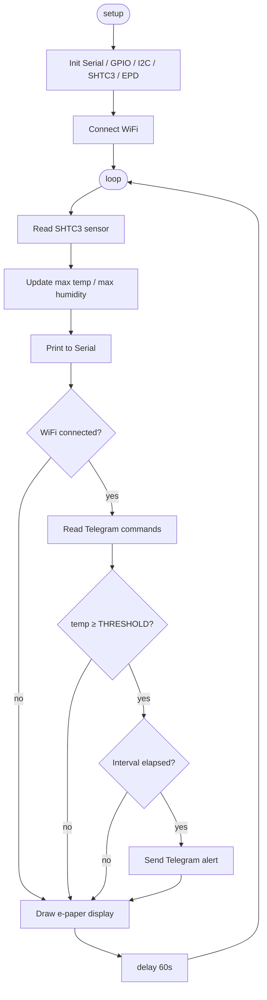
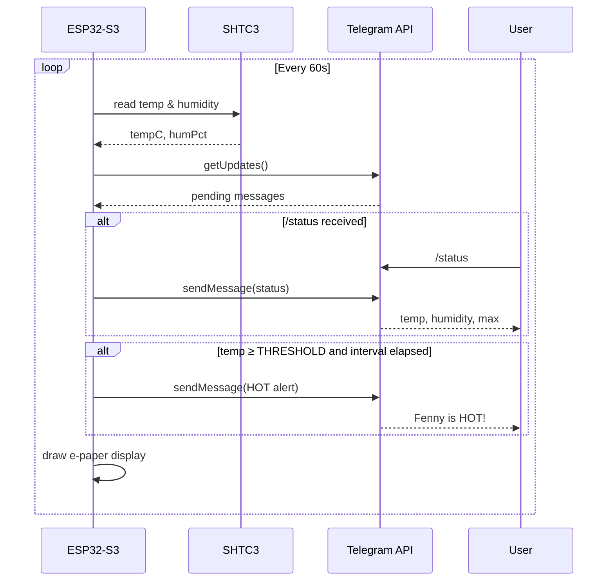

# hot-dog-2

ESP32-S3 temperature/humidity monitor with e-paper display and Telegram alerts.

Monitors a sensor (SHTC3) and displays current + max values on a 1.54" e-ink screen. Sends a Telegram message when temperature exceeds a configurable threshold.

## Hardware

Tested on the [ESP32-S3-ePaper-1.54](https://github.com/waveshareteam/ESP32-S3-ePaper-1.54/) board, which integrates:

- ESP32-S3
- SHTC3 temperature/humidity sensor (I2C)
- GxEPD2 1.54" e-paper display (SPI, D67)

## Setup

1. Copy `config.h.example` to `config.h` and fill in your credentials:

```cpp
#define WIFI_SSID     "your_ssid"
#define WIFI_PASSWORD "your_password"
#define BOT_TOKEN     "your_telegram_bot_token"
#define CHAT_ID       "your_telegram_chat_id"
#define THRESHOLD     27.0f   // °C
```

2. Open `hot-dog-2.ino` in Arduino IDE, install the required libraries, and flash.

## Libraries

- [GxEPD2](https://github.com/ZinggJM/GxEPD2)
- [Adafruit SHTC3](https://github.com/adafruit/Adafruit_SHTC3)
- [UniversalTelegramBot](https://github.com/witnessmenow/Universal-Arduino-Telegram-Bot)

## Telegram alerts

Sends a message every 60 seconds while temperature is above the threshold. No message when temperature is below threshold.

## Loop flow



## Sequence diagram


